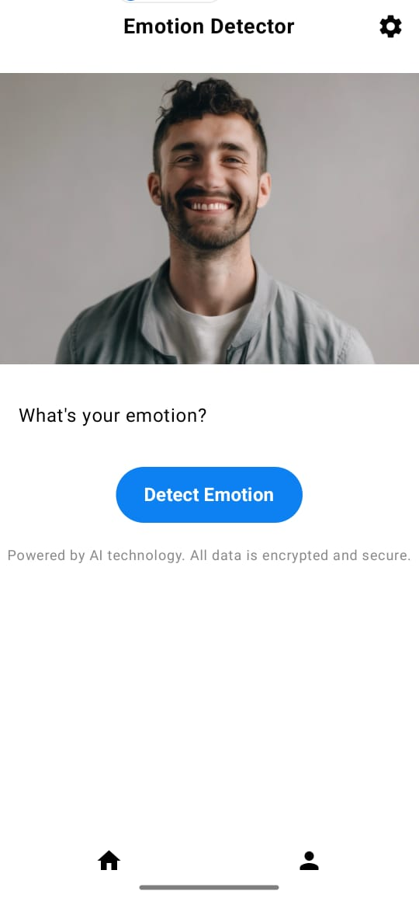
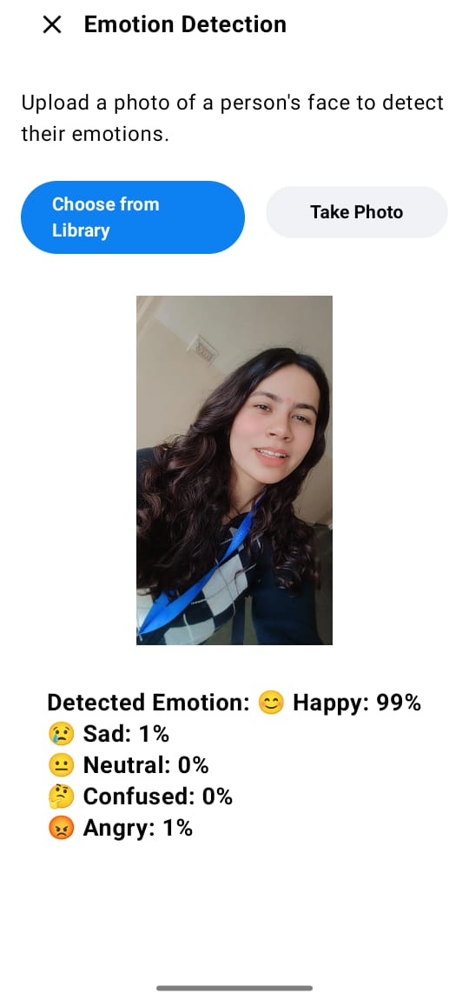

# 🎭 Emotion Detection App

A **Jetpack Compose-based Android app** that detects emotions from images using **ML Kit Face Detection**.  

---

## ✨ Features

✅ Upload an image **from Gallery or Camera**  
✅ Detect emotions with **confidence scores (%)**  
✅ Supports **😊 Happy, 😢 Sad, 😡 Angry, 🤔 Confused, 😐 Neutral**  
✅ **Modern UI with Jetpack Compose**  
✅ Uses **ML Kit Face Detection API** for accuracy  

---

## 📷 Screenshots

| Upload Image | Detecting Emotion | Result |
|-------------|------------------|--------|
|  |  |  |

---

## 🛠️ Tech Stack

- **Kotlin** 🚀
- **Jetpack Compose** 🎨
- **Material 3** ✨
- **ML Kit Face Detection API** 🤖
- **Firebase ML** 🔥

---

## 🚀 Getting Started

### 1️⃣ Clone the Repository

```bash
git clone https://github.com/Masoom08/Emotion-Detection.git
cd Emotion-Detection

